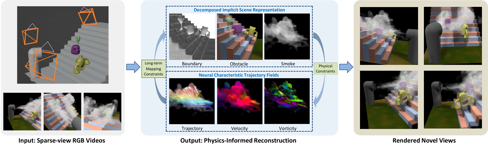

# Physics-Informed Learning of Characteristic Trajectories for Smoke Reconstruction

### [[Project]](https://19reborn.github.io/PICT_Smoke.github.io/)[ [Paper]](https://arxiv.org/abs/2407.09679)

> [Yiming Wang](https://19reborn.github.io/), [Siyu Tang](https://vlg.inf.ethz.ch/team/Prof-Dr-Siyu-Tang.html), [Mengyu Chu](https://rachelcmy.github.io/)

> SIGGRAPH 2024




## Setup
```

# build environment with python 3.7
conda create -n pinf python=3.7
conda activate pinf 

# if ffmpeg is not installed (test by ffmpeg -version)
conda install -c conda-forge ffmpeg 
conda install ffmpeg

# requirments
pip install -r requirments

# raymarching
cd raymarching
pip install -e .

# test environment
python env_test.py

```

**The dataset used in the paper can be downloaded from [Goolge Drive](https://drive.google.com/drive/folders/1q77zZ4U5T3KlmGZfcll7HLddVfH2WE_k?usp=drive_link).**


## Run

### Training

A `base.txt` config is provided for hybrid scene training.

```
python train.py --config configs/base.txt
```

The scalar real world dataset can be trained with the `scalar.txt` config.

```
python train.py --config configs/scalar.txt
```

### Testing

```
# velocity voxel output
python test.py --config configs/cyl.txt --testskip 1 --output_voxel --full_vol_output

# render novel view
python test.py --config configs/cyl.txt --render_only

# static object mesh
python test.py --config configs/cyl.txt --mesh_only
```


## Installing problem
- Ninja is required to load C++ extensions
```
pip install Ninja
```


## Citation
```
@inproceedings{Wang2024PICT,
  author = {Wang, Yiming and Tang, Siyu and Chu, Mengyu},
  title = {Physics-Informed Learning of Characteristic Trajectories for Smoke Reconstruction},
  year = {2024},
  url = {https://doi.org/10.1145/3641519.3657483},
  doi = {10.1145/3641519.3657483},
  booktitle = {ACM SIGGRAPH 2024 Conference Papers},
  articleno = {53},
  numpages = {11},
  series = {SIGGRAPH '24}
}
```
